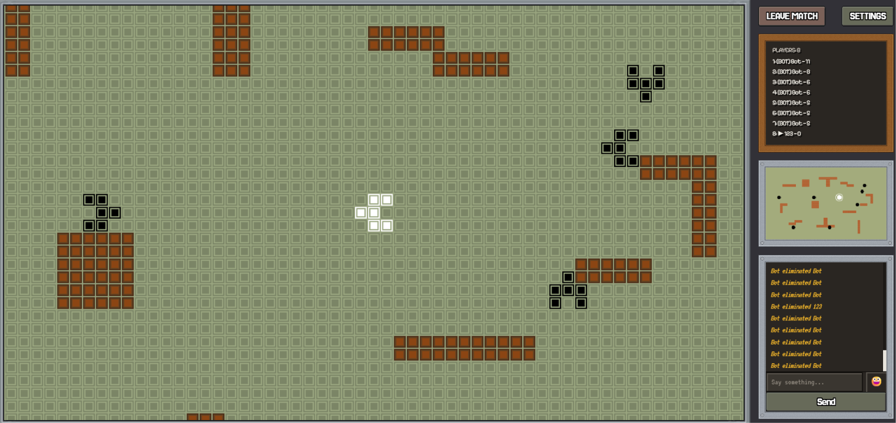

<div align="center">

# TANK BATTLE

**A multiplayer pixel-art tank battle game**
Socket.io · Canvas · Brick Game 9999-in-1 vibes




[Features](#features) · [Controls](#controls) · [Getting started](#getting-started) · [Production](#production)

</div>

---

## Features

|     |     |
|-----|-----|
| **Two game modes** | Real-time PvP deathmatch and co-op base defense against escalating bot waves |
| **18 built-in arenas** | 9 PvP and 9 co-op maps, each with its own layout theme |
| **Custom maps** | In-browser map editor — walls, bricks, base, enemy spawn points |
| **Rooms & lobby** | Always-on quick-play rooms, public/private rooms by code or link, host-restartable settings |
| **Accounts** | Register/login, persistent rating, PvP result settlement, leaderboard API |
| **Adaptive bots** | Dodge, hunt, BFS pathfinding; difficulty scales with the room's average rating |
| **In-battle chat** | Emoji picker, system messages, mobile dock |
| **Mobile-ready** | On-screen d-pad, hold-to-autofire fire button, minimap & roster modals |

<details>
<summary><strong>Screenshots</strong></summary>

[](http://misha97.ho.ua/game.png)

</details>

## Controls

| Action | Keyboard | Mobile |
|--------|----------|--------|
| Move   | <kbd>W</kbd><kbd>A</kbd><kbd>S</kbd><kbd>D</kbd> / arrows — hold to keep moving, one direction at a time | on-screen d-pad |
| Shoot  | <kbd>Space</kbd> | FIRE button — hold to autofire |
| Chat   | <kbd>Enter</kbd> | CHAT button |

Your login doubles as your in-game callsign — set it once on the `/account` page,
along with your tank color.

## Project layout

npm workspaces monorepo — see [`CLAUDE.md`](CLAUDE.md) for the full architecture writeup.

```
/shared     Types shared by server and client (game state, socket events, constants)
/server     Express + Socket.io + Prisma (MySQL), TypeScript
/client     Vite + TypeScript client, canvas rendering
```

## Getting started

Requires a local MySQL server (no Docker) — install MySQL 8+, then create the
database and user:

```sql
CREATE DATABASE tank;
CREATE USER 'tank'@'localhost' IDENTIFIED BY 'tank';
GRANT ALL PRIVILEGES ON tank.* TO 'tank'@'localhost';
```

```bash
git clone https://github.com/misha1997/tank-pixel-game.git
cd tank-pixel-game
npm install

cp server/.env.example server/.env   # then set a real SESSION_SECRET
cd server && npx prisma migrate dev && cd ..

npm run dev
```

Open http://localhost:5173 — the client dev server proxies API/socket requests to
the backend on port 5000. Open it in a few browser windows or tabs to try multiplayer.

## Production

```bash
npm run build              # builds shared, server, client
npm run db:migrate:deploy  # applies pending Prisma migrations
npm start                  # node server/dist/index.js — serves the built client too
```

Or via PM2 (`ecosystem.config.cjs`):

```bash
npm run deploy    # build + migrate + pm2 startOrReload
npm run pm2:logs
npm run pm2:monit
```

`server/.env` (`DATABASE_URL`, `SESSION_SECRET`, `PORT`) must exist before starting
in either mode.

### Docker (fallback)

The default setup above is docker-less. If you'd rather run the whole stack
(MySQL + built server/client) in containers instead:

```bash
docker compose up -d --build
```

This builds the app image from the root `Dockerfile`, starts MySQL, applies
Prisma migrations on boot, and serves the game on http://localhost:5000.
Change `SESSION_SECRET` (and the MySQL credentials) in `docker-compose.yml`
before deploying for real.

---

<div align="center">

Want to help develop this game? Let's do it!
<a href="mailto:mishaotroshenko2013@gmail.com">mishaotroshenko2013@gmail.com</a>

</div>
